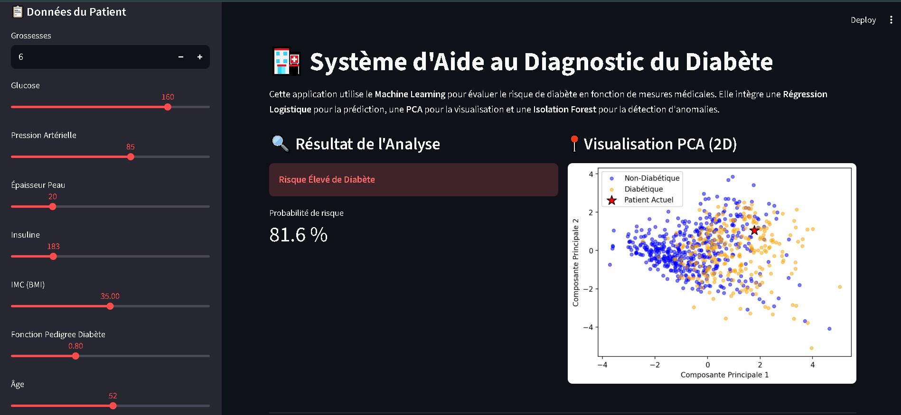
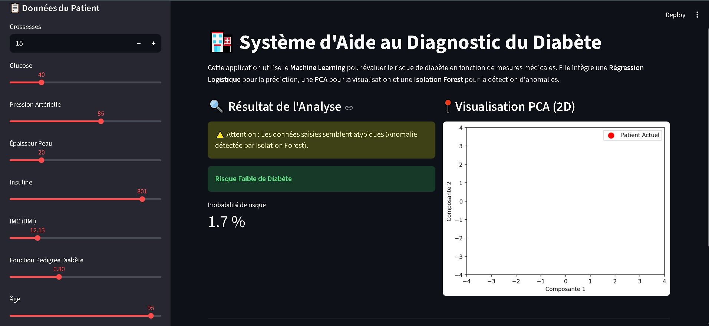
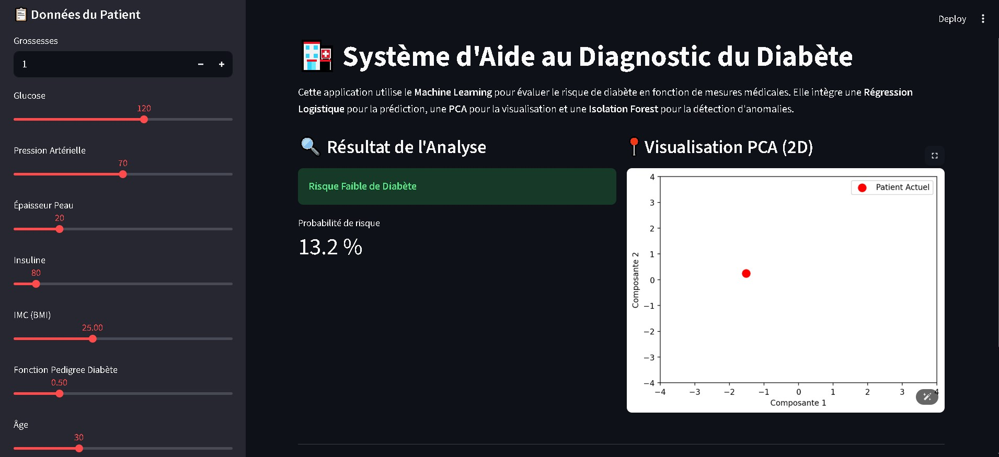

# 🏥 Système d'Aide au Diagnostic du Diabète par IA

Ce projet est une application web interactive basée sur le **Machine Learning**, conçue pour évaluer le risque de diabète à partir de données cliniques.

## 🎯 Objectif du Projet
L'objectif est de fournir une interface simple et efficace pour prédire le risque de diabète. L'application ne se contente pas de donner un résultat binaire, elle analyse également la cohérence des données soumises et permet de visualiser le profil du patient par rapport à la population connue.

## 🧠 Fonctionnalités & Modèles
L'application s'appuie sur trois composants d'IA complémentaires :

1.  **Prédiction (Régression Logistique)** : 
    *   Ce modèle estime la probabilité qu'un patient soit diabétique.
    *   Il se base sur des critères médicaux standards : Glucose, IMC, Âge, Pression artérielle, Insuline, etc.
    
    

2.  **Détection d'Anomalies (Isolation Forest)** : 
    *   Ce modèle de détection d'outliers vérifie si les données saisies sont cohérentes.
    *   Il alerte l'utilisateur si le profil du patient est atypique (données potentiellement erronées ou cas clinique rare).

    

3.  **Visualisation (PCA)** : 
    *   Utilisation de l'Analyse en Composantes Principales pour réduire les 8 dimensions médicales en 2 dimensions.
    *   Permet de visualiser graphiquement où se situe le patient testé par rapport à la distribution des données d'entraînement.

    

## 📂 Structure du Dossier
Le projet est organisé pour séparer clairement les données, le code d'entraînement et l'application finale :

*   **`app.py`** : C'est le script principal de l'application **Streamlit**. Il contient le code de l'interface utilisateur et la logique de chargement des modèles pour la prédiction en temps réel.
*   **`data/`** : Ce dossier contient les données sources.
    *   `diabetes.csv` : Le dataset utilisé pour l'entraînement, issu de **Kaggle** (Pima Indians Diabetes Database).
*   **`models/`** : Ce dossier contient les modèles entraînés et sauvegardés (fichiers `.pkl`), prêts à être utilisés par l'application :
    *   `model_logistique.pkl` (Prédiction)
    *   `iso_forest_model.pkl` (Anomalies)
    *   `pca_model.pkl` (Visualisation)
    *   `scaler.pkl` (Normalisation des données)
*   **`notebooks/`** : Contient les expérimentations.
    *   `train_models.ipynb` : Le notebook Jupyter détaillant tout le processus de Data Science : chargement des données, nettoyage (traitement des valeurs manquantes), standardisation et entraînement des modèles.

## 🚀 Installation et Lancement

1.  **Installation des dépendances** :
    ```bash
    pip install -r requirements.txt
    ```

2.  **Lancement de l'application** :
    ```bash
    streamlit run app.py
    ```

## 📊 Données
Les données proviennent de Kaggle. Elles concernent des relevés médicaux (nombre de grossesses, glucose, pression artérielle, etc.) utilisés pour entraîner les algorithmes à reconnaître les signatures du diabète.
